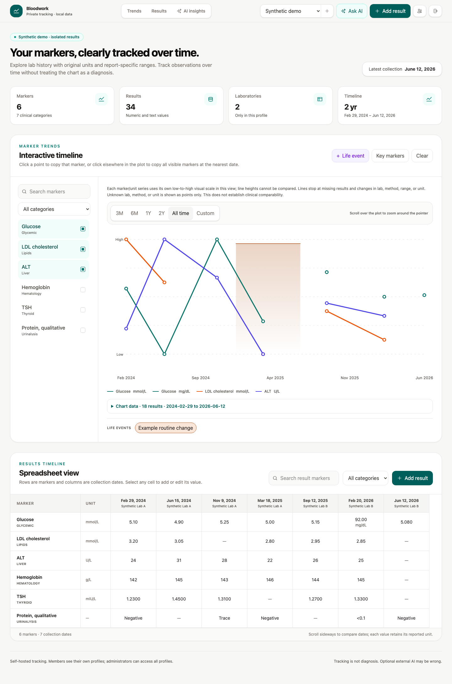

# Bloodwork Local

A private, self-hosted tracker for people who want to review laboratory results across time without losing the units, dates, and context from each report.



Every observation and annotation shown here is invented. No patient reports or real medical data are included. [Mobile view](docs/images/synthetic-mobile.png) · [Engineering case study](docs/case-study.md)

## What works

- Enter, edit, and delete numeric, qualitative, or limit results; import reviewed JSON manifests or simple XLSX timelines with an explicit preview.
- Keep multiple profiles, select markers, compare an inclusive date range, inspect exact values in a chart data table, and add timeline annotations.
- Preserve entered precision and per-observation units, lab, method, and reference text. Missing measurements stay missing. No automatic conversions or universal “normal” ranges.
- Authenticate with server-side sessions. Members see their own profiles; administrators can access all profiles and manage accounts.
- Optionally ask an external AI provider about selected observations, using an operator-supplied API key and explicit transfer consent.

This is a personal/self-hosted application with basic account ownership, **not a production-ready multi-tenant SaaS or a clinical decision system**. There is no billing, organization model, public signup, built-in PDF/OCR upload, or automatic medical interpretation. PDF extraction is an optional, reviewed agent workflow described below. See [security boundaries and limitations](docs/security.md).

## Run the synthetic demo

Requires **Node.js 22.13 or newer within the 22.x line** and npm. The version line is also in `.nvmrc`. SQLite is embedded; no database service or paid credentials are needed.

From a fresh clone:

```bash
npm ci
cp .env.example .env
npm run demo
npm run dev
```

Open [http://127.0.0.1:5173](http://127.0.0.1:5173) and sign in as **demo** with password **synthetic-demo-only**. These are public demo credentials. Use only synthetic data with this account and keep the server bound to localhost.

The demo contains six markers across six collection dates, two invented labs, missing measurements, qualitative results, a changed unit, varied reference text, and a fictional event. It is authored in [demo/history.mjs](demo/history.mjs), independently of any patient data. It is not a medically validated example.

Seeding uses exclusive file creation and **refuses any existing database**, even an empty one. It never resets data. To use another destination, set `BLOODWORK_DB_PATH` in your private `.env` before seeding and starting. Do not remove a database just to retry setup.

If the default ports are occupied, set `PORT` (API, default 8787) and `VITE_PORT` (frontend, default 5173) in `.env`; the development proxy follows `PORT`. For example: `PORT=18789 VITE_PORT=15173 npm run dev`, then open `http://127.0.0.1:15173`. Both servers bind to loopback by default.

Try this sequence:

1. Clear the selection, then select Glucose and LDL cholesterol. Notice the gap and the separately plotted glucose unit.
2. Choose 3M, All time, or Custom. Open **Chart data** to inspect exact values, labs, methods, and report ranges without hovering.
3. Add a result, reload, and edit its spreadsheet cell.
4. Switch to **Empty synthetic profile** to see the empty state.

For a clean personal installation, use `npm run setup` **instead of** `npm run demo`. It creates an administrator with a generated password printed once. Save that password. Setup refuses to replace existing users.

### Import more synthetic observations

```bash
npm run import -- --profile-id 1 --profile-name 'Synthetic demo' --manifest demo/import-example.json
# Review the dry-run counts, then explicitly apply:
npm run import -- --profile-id 1 --profile-name 'Synthetic demo' --manifest demo/import-example.json --apply
```

This adds a seventh date. Running it again reports identical observations. Conflicts reject the entire batch. Apply creates a private SQLite backup beside the selected database before rechecking and committing the import. Dry-run opens the existing database read-only. There is no reset or overwrite option.

The same command accepts `--workbook PATH` instead of `--manifest PATH`. See the [format contract](skills/bloodwork-profile-import/references/manifest-and-workbook.md): use manifests when units, labs, methods, or ranges vary between observations. Only trusted local workbooks are supported.

### Use the included import skill

[skills/bloodwork-profile-import/SKILL.md](skills/bloodwork-profile-import/SKILL.md) is a portable workflow for an agent that can inspect local reports. It confirms patient identity, inventories duplicate sources, reviews extracted values and metadata, prepares a manifest, and previews an import. It has no hardcoded user, directory, workbook, or provider. Its small adapter calls this app's maintained importer.

In an agent environment that supports skills, explicitly point it to this repository copy:

> Use the bloodwork-profile-import skill at skills/bloodwork-profile-import/SKILL.md. The app is this repository. My private source directory is [path]. Confirm the target profile ID and name, review extracted observations, and prepare a dry-run. Ask before using an external extraction provider.

Alternatively, install **a copy** of this folder in your agent's user/project skill directory according to that agent's instructions. Do not overwrite an existing customized skill. No agent tooling is needed to run the app or importer.

The workflow can be adapted to other trackers by replacing the destination contract/adapter. The included script supports this repository's schema only. PDF/OCR tooling is supplied by your agent environment, and human review is required. The app itself does not parse PDFs or send documents to AI.

## Architecture and decisions

```text
Manual entry / reviewed manifest or workbook
        ↓ validation + profile authorization (API) / local operator (CLI)
Express API ── SQLite: users → profiles → markers → records
        │                         └→ events and saved chats
        ↓
React state → selected markers + calendar range → SVG chart + exact-value table
        └→ optional consented request → server-built context → external BYOK provider
```

- **One local database, explicit ownership.** SQLite constraints and transactions enforce one result per marker/date and matching record/marker profiles. API ownership checks protect the account boundary. Additive migrations run on startup; existing observations are never automatically imported or replaced. A single Node process keeps deployment small; sessions and AI jobs are in memory, so restarts require sign-in and discard unfinished jobs.
- **Preserve observations before comparing them.** Marker identity is profile + category + case-insensitive name. Units, ranges, lab, and method belong to each result. The original numeric spelling is retained; a bounded floating-point value is used for plotting. Lines break at missing/qualitative results and changes in comparison metadata. Unknown unit/lab/method produces points only. Mixed units use explicitly labeled independent visual scales; the exact-value table remains authoritative.
- **Share invariants, not duplicate import logic.** UI/API and imports share date/value validation. The CLI previews, backs up, and commits one transaction; repeated imports are idempotent and conflicting data requires review. The bundled skill delegates to that importer. AI context is separately constructed on the server from authorized records and the exact selected timeframe.

Ownership is intentionally small: categories and profile-name uniqueness remain global, the administrator is trusted, and local filesystem access grants access to the database. This is not tenant-grade isolation. For more detail, read [the case study](docs/case-study.md).

## Optional AI: bring your own key

Tracking, imports, charts, and the demo work without AI. There is no self-hosted AI endpoint or bundled provider credential.

- **OpenAI:** an administrator can add a key in AI settings over HTTPS or localhost, or set `OPENAI_API_KEY`. File-managed keys are stored server-side with mode `0600`; the API returns only configuration status. Requests use the Responses API with `store: false`.
- **OpenRouter:** set `OPENROUTER_KEY` in the private `.env`. Requests may go to a downstream model provider. Model availability and provider terms can change; no free-service availability is promised.

Keys are operator-managed and shared across authorized app users. Requests may incur charges. No live paid-provider call is part of the demo or tests.

Sending a chat requires consent. The provider receives selected marker labels, dated observations, original units, report ranges, methods, labs, result notes, overlapping event titles/notes/substances, the prompt, and chat messages. The profile's display name and source documents are not included in structured context, but free text may identify someone. Stored chat history can contain earlier context. `store: false` does not promise zero provider retention. AI may produce wrong or unsafe interpretations; guardrail text is not clinical validation.

## Verification and other run modes

```bash
npm run check                 # regression tests, production build, syntax checks
npx playwright install chromium
npm run test:browser          # real UI against a temporary synthetic database
npm audit                    # current registry advisories
git diff --check
```

Tests exercise dates, precision, duplicate/conflicting imports, migration preservation, cross-account and cross-profile access, AI context/job ownership, provider failure, keyboard dialogs, mobile overflow, and chart/table consistency. AI responses in API tests are explicitly stubbed; no real key is used. Browser tests run the key-free error path.

To regenerate synthetic screenshots from a fresh demo: `UPDATE_DEMO_SCREENSHOTS=1 npm run test:browser -- --grep 'capture reproducible'`. Review the images before committing them. [Validation record](docs/verification.md) distinguishes local checks, completed GitHub Actions verification, and deployment status.

```bash
npm run build
npm start                     # serves built UI and API at http://127.0.0.1:8787
```

If SQLite reports a native-module version mismatch, switch to Node 22 and rerun `npm ci`. On platforms without a matching prebuilt SQLite binary, npm needs a working native build toolchain.

Docker Compose is an optional local packaging path: it binds the host port to loopback and mounts `./data`; it never includes data in the image. After `docker compose build`, use `docker compose run --rm bloodwork node server/demo.mjs` (or `server/setup.mjs`) and then `docker compose up -d`. The mounted directory must be writable by container UID 1000. This path is separate from a public deployment and its validation status is recorded above.

For a remote private installation, configure HTTPS, `NODE_ENV=production`, a trusted reverse proxy, protected data storage, and backups. Never expose the Vite development server or public demo credentials. Anti-indexing directives are retained but are not access control.

## Portfolio, authorship, and license

The author designed the product idea, architecture, and detailed behavior. AI assisted with implementation and the original private PDF-to-data preparation; this public preparation was also AI-assisted. The engineering evidence is the decisions, reviewable code, and reproducible checks, not the volume of generated code. No adoption, revenue, time-saving, or clinical-outcome claims are made.

[MIT license](LICENSE). Dependency and asset attribution is in [THIRD_PARTY_NOTICES.md](THIRD_PARTY_NOTICES.md). Source publication does not deploy an application or grant access to private data. See [publication preparation](docs/publication.md) for the explicit file allowlist and fresh-history export.
